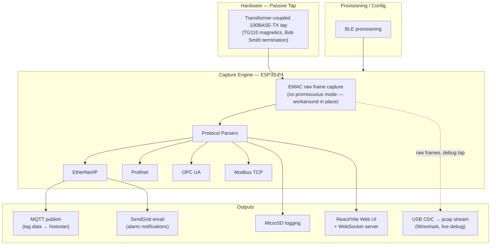

# TapLink — Architecture & Feature Tracker

_Last updated: 2026-09-01_

This doc is the "schematic + BOM" for TapLink's firmware/system architecture: a block diagram showing how pieces connect, a feature table tracking status, and ADRs capturing the reasoning behind key decisions. Update it as features move status or new decisions get made — treat it like a living doc that lives next to the firmware repo.

---

## 1. System Block Diagram

_Note: dotted line = debug-only path, not part of normal production data flow._

---

## 2. Feature Table

| Feature | Status | Depends on | Notes |
|---|---|---|---|
| Passive tap PCB (hand-wound toroids) | Done | — | Current rev not PnP-friendly; ground-up redesign planned |
| PnP-compatible tap redesign | Planned | Current tap design | Hard requirement: no manual wire-winding in build process |
| Raw Ethernet frame capture | Done | Tap hardware | ESP32-P4 EMAC; no `ETH_CMD_S_PROMISCUOUS` support — workaround found |
| EtherNet/IP parsing | Done | Raw capture | |
| Profinet parsing | In progress | Raw capture | |
| OPC UA parsing | In progress | Raw capture | |
| Modbus TCP parsing | In progress | Raw capture | |
| MQTT tag publish | Done | Protocol parsers | Publishes to historian |
| Email alarm notifications | Done | Protocol parsers | Via SendGrid |
| MicroSD logging | Done | Protocol parsers | |
| React/Vite Web UI + WebSocket server | Done | Protocol parsers | |
| BLE provisioning | Done | — | |
| USB pcap → Wireshark (basic serial stream) | Designed | Raw capture | pcap global + per-packet headers over USB CDC; code sketched |
| USB pcap → Wireshark (extcap script) | Not started | Basic USB pcap | Would make it show up as a native Wireshark interface — deferred |
| TZSP/UDP live capture | Deferred | Raw capture, WiFi STA | Deprioritized — USB path covers the real debug need |
| Standalone Amazon tap (no MCU) | Concept | — | Fallback/parallel product if ESP32-P4 smart historian doesn't pan out |
| FCC certification | Not started | Final hardware design | Pre-certified WiFi module identified as cost-reduction path |

**Status legend:** Concept → Designed → In progress → Done → (Deferred = intentionally shelved)

---

## 3. Architecture Decision Records (ADRs)

### ADR-001: Build small batches vs. license or sell IP outright
**Decision:** Sell finished units directly in small batches rather than licensing the design or an outright IP sale.
**Why:** Direct sales path better supports the funding goal (house/land/workshop) than a licensing deal would.

### ADR-002: WiFi-only connectivity for v1
**Decision:** Ship with WiFi only; treat cellular (LTE-M/NB-IoT) as a future addition, not a launch requirement.
**Why:** Reduces scope for initial hardware/firmware bring-up; most industrial sites have WiFi infrastructure or can get it added more easily than cellular service.

### ADR-003: All parts must be pick-and-place friendly
**Decision:** No manual wire-winding or hand-assembly steps allowed in the production design.
**Why:** Hand-wound toroids don't scale to a manufacturable product — this forces a redesign of the tap transformer stage before it can ship.

### ADR-004: Single merged output for the Amazon-sellable passive tap
**Decision:** Use two SPI Ethernet ICs feeding one MCU that regenerates a single merged output, instead of exposing two separate monitor connections.
**Why:** Simpler for the end user — one cable out instead of juggling two directions.

### ADR-005: ESP32-P4 over Raspberry Pi Pico for the standalone tap prototype
**Decision:** Use ESP32-P4 (not RP2040/Pico) for the v1 standalone tap.
**Why:** Native 100Mbps Ethernet + USB High-Speed support, needed to merge both tapped directions into one output at full throughput without external hardware.

### ADR-006: Separate capture board + off-the-shelf ESP32-P4 Nano for first prototype
**Decision:** Build the tap + SPI Ethernet IC circuitry as its own board, connected via headers to an ESP32-P4 Nano dev board, rather than one integrated PCB.
**Why:** De-risks the prototype — isolates the tap/analog circuitry from the MCU board so each can be debugged independently before committing to a single integrated layout.

### ADR-007: USB pcap stream over TZSP/UDP for live Wireshark debugging
**Decision:** Prioritize a USB-based pcap stream to Wireshark over a WiFi/TZSP-based one.
**Why:** No network dependency (works even with client isolation or no WiFi present), simpler to reason about for bench debugging, and matches the actual audience (engineers doing bring-up/field debug) better than a network-only path.

---

## How to keep this current

- Update the **feature table** status column as things move — this is your single source of truth for "what's actually done."
- Add a new **ADR** whenever you make a call that trades off one approach for another and might get questioned later (by yourself in six months, or eventually a collaborator/hire).
- Regenerate the **block diagram** when the data flow changes shape (new output, new parser, new hardware revision) — keep it text-based (Mermaid) so it diffs cleanly in git.
